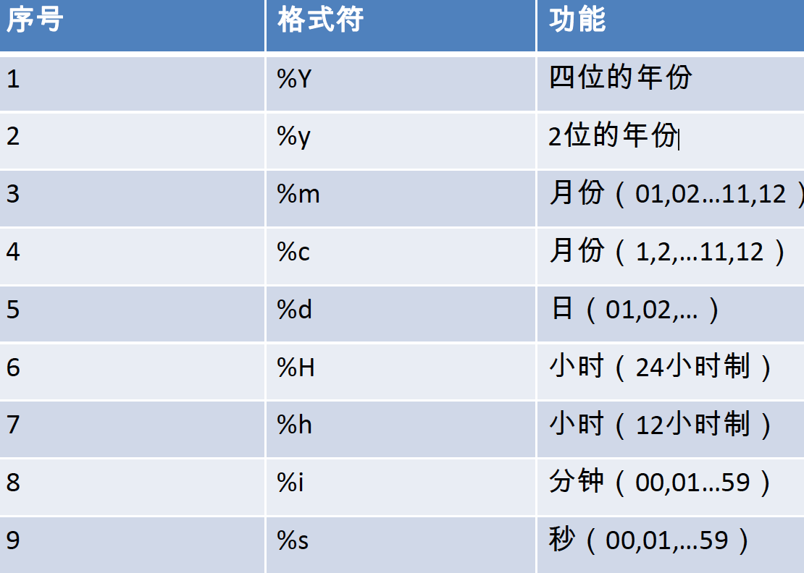

## MySQL相关函数

### 单行函数
- 字符函数
	* lenght('xxxx') 获取字符**字节**数
	* concat([字段名],'xxx','xx') 拼接成字符串
	* upper('xxx')	字符串全部大写(对英文)
	* lower('xxx')	字符串全部小写(对英文)
	* substr(‘xxx’,[option])	从'xxx'字符串中从[option]开始截取字符，索引从**1**开始
	* 	substr(‘xxx’,[option],[length]) 从'xxx'字符串中从[option]开始截取字符，截取[length]长度，索引从**1**开始
	* substring()		截取**字符**长度
	* instr('xxxyyy','yyy')  用于返回'xxxyyy'中出现的'yyy'第一次出现的索引
	* trim(' xxxx  ')			用于去除的前后空格符
	* trim('x' from 'xccc xxxx  xxx') 	去掉前后的'x'字符
	* lpad('aaa',10,'[*]')	用'[*]'左填充指定长度(不足10，填充)
	* rpad('aaa',10,'[*]')	与lpad方向相反的填充
	* replace('xxxxyyy','xxx','aaa')  替换'xxxxyyy'中的xxx为aaa
- 数学函数
	* round(19.22) 四舍五入
	* round(19.232,22)	四舍五入保留两位小数
	* ceil(19.222) 	向上取整
	* floor(19.22)	向下取整
	* truncate(1.65,1)  小数点保留几位(这里为1为)
	* mod(10,3)	取模运算(10与3取模)
- 日期函数
	* now()	返回当前系统日期+时间
	* curdate()	返回当前系统日期，不包含时间
	* curtime()	返回当前时间，不包含日期
	* year([日期对象,例如传入now()])		返回年
	* month([日期对象,例如传入now()])	返回月
	* monthname([日期对象,例如传入now()])	返回月名
	* str_to_date('m-dd-yyyy','%Y-%c-%d') 将字符通过制定的格式转换成日期
	* datediff('日期1','日期2')  计算两者日期之差
	* date_format('2018-2-2','%Y/%c/%d') 	将日期转换成字符  ->  结果:`2018/2/2`
	
- 其他函数
	* version()	查看数据库版本信息
	* database()	查看当前数据库
	* user()		查看当前用
- 流程控制函数
	* if(exp1,exp2,exp3)   如果exp1成立，则返回exp2,否则返回exp3
	* case 要判断的字段或表达式 when 常量1 then	结果1 when 常量2 then 结果2 ... else 结果N end 	类似java中的switch语句
	* 多重if:
		```
		case
			when 条件1 
			then 结果1
			when 条件2
			then 结果2
			else	
			结果n
		end
		```
		
### 分组函数
- SUM	求和

> select sum(salary) from employees;

- AVG	求平均值

> select avg(salary) from employees;

- MAX	求最大值 

> select max(salary) from employees;

- MIN	求最小值

> select min(salary) from employees;

- COUNT	求记录的总数

> select count(salary) from employees;

分组函数用于数值型数据。`count`函数会取出不为NULL的数据总数。
SUM、AVG一般用去数值型，MAX、MIN、COUNT可以处理任何类型。
所有的分组函数中`NULL`值都`不参与`运算。

分组函数中可以使用`distinct`,举例:

`select sum(DISTINCT salary) from employees`

先除去重复的数据，之后进行求和运算。

同理: max、min、count、avg分组函数都支持去重运算。

**重点** count(*)统计算有字段，只要`一行`中有一个有值，则+1计入到总计中。经常使用的是([*])，也有人用(1),用来统计多少条记录(`count([字段值])`的方式会忽略值为`NULL`的行，所以用`count(*)`>=`count([字段值])`的行数)

**重点：和分组函数一同查询的字段要求是group by后的字段**

### 分组查询

关键字句:`group by`

```sql
select 分组函数,列(要求出现在group by的后面)
from 表名
where 条件
group by 分组列表
order by 排序列1 desc,排序列2 asc...
limit 起始位置(0索引开始计),取多少条记录;
```

```sql
SELECT COUNT(*),location_id FROM 
employees
GROUP BY location_id;
```
**以上查询结果: 查询出每个位置的部门个数。重点关键字: `每个`**


